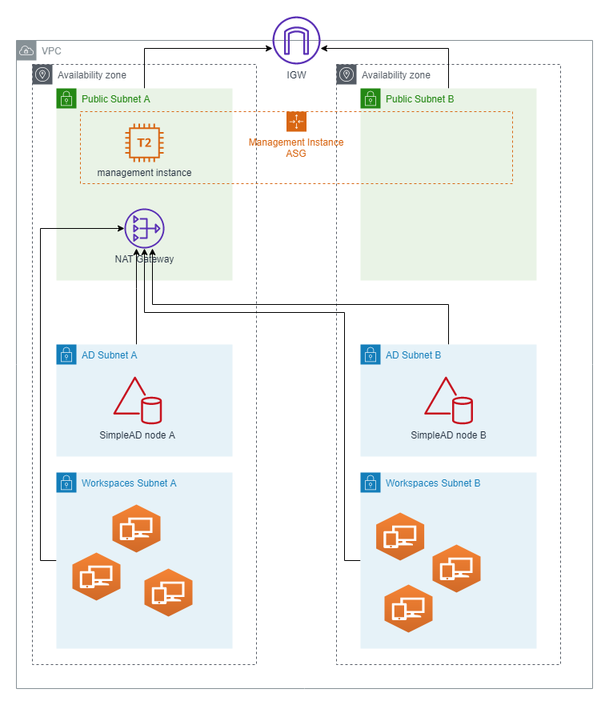

# workspaces-demo

This project allows you to start with AWS Workspaces.

## Getting Started

These instructions will get you a copy of the project up and running on your AWS Account

### Prerequisites

You will need:

- AWS Account
- `aws-cli` and `curl` installed
- Amazon Workspaces client (https://clients.amazonworkspaces.com/)




### Deploying infrastructure stack

`infrastructure.template` will create following resources:
* VPC
* DHCP Option with DNS adresses of SimpeAD nodes
* Two public subnets for management instance and NAT Gateway
* Two private subnets for SimpeAD nodes
* Two private subnets for Worksapces machines
* Launch template and Auto Scaling Group for management instance
* SSM document association for Domain Join automation
* Secrets Manager secret for domain Administrator password

#### Prameters

You can use default parameters provided in the template, or specify:

- `projectName` - Default: `workspaces` - project name used in resources names and tags
- `stage` - Default: `dev` - deployment stage (dev, qa, prod, test)
- `cidrPrefix` - Default: `10.0` - VPC CIDR Prefix
- `availabilityZones` - Default: `a,b` - Availability Zones to use
- `domainName` - Default: `workspaces.local` - Simple AD domain name
- `simpleAdManagementAmiId` - Default: `/aws/service/ami-windows-latest/Windows_Server-2019-English-Full-Base` - AMI ID for management instance
- `simpleAdManagementInstanceType` - Default: `t2.micro` - management instance type
- `simpleAdManagementRdpAccessSourceIp` - No default value - Public adress of management inscante operator host.

#### Deployment

```bash
aws --region eu-west-1 cloudformation create-stack --stack-name workspaces-infrastructure \ 
--template-body file://$(pwd)/infrastructure.template \
--parameters ParameterKey=simpleAdManagementRdpAccessSourceIp,ParameterValue=$(curl ifconfig.co)/32 \
--capabilities CAPABILITY_NAMED_IAM

```

## Authors
* **Tomasz Bres** - *Initial work*